# Actions Library

This is the state of action in the Actions Library in UI Bakery projects.

Out of scope:

- actions in `POC Actions` folder(s)

Actions below are listed in the order the appear in UI Bakery. Some names
are decorated with one or more of the following symbols.

## Production Actions

## Production Actions / Mailgun

### prod_mailgun_emailViaTemplateArray

- Input:

  ```json
  {
    "codeEmailArrayBuilder": [],
    "emailSendArray": [
      {
        "first_name": "Oz",
        "last_name": "The Wizard",
        "email": "joe@example.com",
        "license_key": "0123-456789A-BCDEFG-HIJKL-MNOPQRS"
      }
    ],
    "email_template": "0241216 - free lb upgrade and update price info",
    "from_email": "noreply@example.com",
    "email_subject": "Example",
    "cc": "",
    "bcc": "", 
    "email_send_tag": "",
    "submitter": "",
    "batch_id": "",
    "submission_status": ""
  }
  ```

- **Q** what is `codeEmailArrayBuilder`
- For every object in `emailSendArray` creates another object with given
  properties and converts it into a specific JSON string. Returns an array of
  such strings.

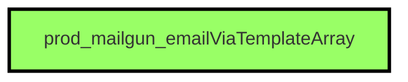


### prod_mailgun_emailViaTemplate_single

- Input:

  ```json
  {
    "lb_id": "",
    "email_template_name": "",
    "email_from_address": "",
    "email_to": "",
    "email_metadata": "",
    "email_subject": ""
  }
  ```

- Set status of the specified (identified by `lb_id`) record to `PENDING`, 
  sends an email using Mailgun and updates the status to `SENT`.

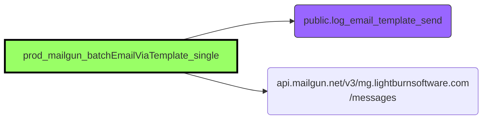

### prod_mailgun_batchEmailViaTemplate_single

- Input:

  ```json
  {
    "submitter": "",
    "batch_id": "",
    "email_template": "",
    "from_email": "",
    "emailSendVariables": {
        "email": ""
    },
    "email_subject": "",
    "email_send_tag": "",
    "json_variables": ""
  }
  ```

- Inserts a row into the table `public.log_email_template_send` for a subsequent
  batch job.

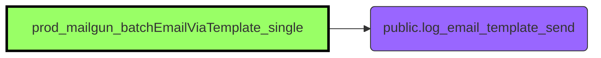

### prod_mailgun_getEmailTemplates

- Input: none

- Gets all the templates from Mailgun and performs some templated replacements.


## Production Actions / Utils

### prod_utils_getGuid

- Input:

  ```json
  {
    "guid_format": "xxxx-xxxx-4xxx-yxxx-xxxxxx"
  }
  ```

- Returns a GUID. Default format is `xxxx-xxxx-4xxx-yxxx-xxxxxx`.


### prod_utils_convertObjToJson

- Input: any

- Returns a string with JSON representation of an object.


### prod_util_getRandomPassword

- Input: none

- Generates a _random_ password of length 12, consisting of ASCII characters
  (both lowercase and uppercase) and digits.


### prod_util_isValidEmail

- Input: a string

- Verifies that the given string syntactically corresponds to an email address.
  The check is very forgiving, it essentially  guarantees that there are `@` and
  `.`characters and no spaces.


### prod_util_copyToClipboard

- Input: a string

- Copies the text onto the clipboard.


### prod_utils_compareTwoObj

- Input:

  ```json
  {
    "objectLeft": {},
    "objectRight": {}
  }
  ```

- Calculates the checksum of the string.

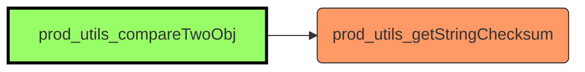

### prod_utils_getStringChecksum

- Input: a string

- Calculates the checksum of the string.

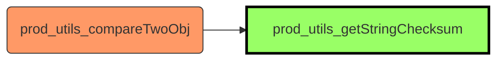

## Production Actions / Access - Web Service

### prod_access_validateApiKeyUnique

- Input:

  ```json
  {
    "api_key": "key",
  }
  ```

- Checks that the given key is not yet in the database.

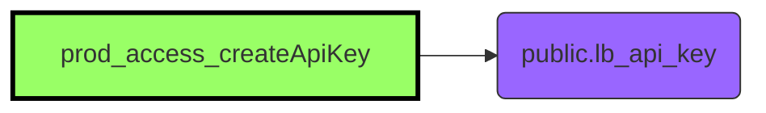

### prod_access_createApiKey

- Input:

  ```json
  {
    "aki_key_lb_id": "ws",
    "capability": "",
    "granted_by_email": "granted.by@example.com"
  }
  ```

- Verifies the input (!) and inserts the record into the database.

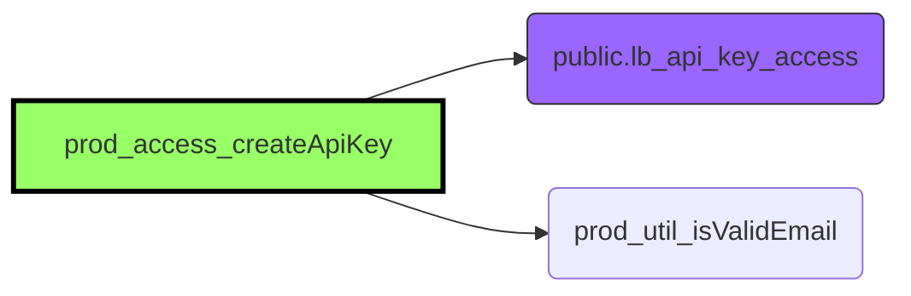

### prod_access_addApiKeyAccess

- Input:

  ```json
  {
    "aki_key_lb_id": "ws",
    "capability": "",
    "granted_by_email": "granted.by@example.com"
  }
  ```

- Verifies the input (!) and inserts the record into the database.

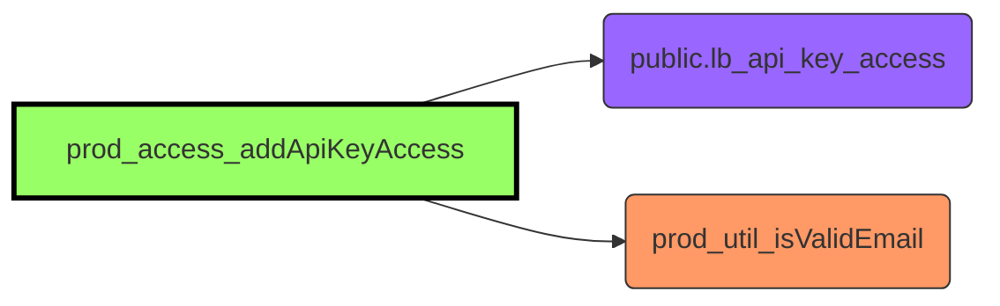

### prod_access_removeApiKeyAccess

- Input:

  ```json
  {
    "aki_key_lb_id": "ws",
    "capability": ""
  }
  ```

- Verifies the input (!) and removes the associated record from the database.

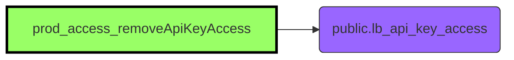

### prod_access_enableDisableApiKeyAccess

- Input:

  ```json
  {
    "aki_key_lb_id": "ws",
    "authorized": "key",
    "capability": ""
  }
  ```

- Verifies the input (!) and flips the `authorized` flag in the database
  accordingly.

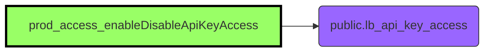

### prod_access_enableDisableApiKey

- Input:

  ```json
  {
    "aki_key_lb_id": "ws",
    "authorized": "key",
  }
  ```

- Verifies the input (!) and flips the `authorized` flag in the database
  accordingly.

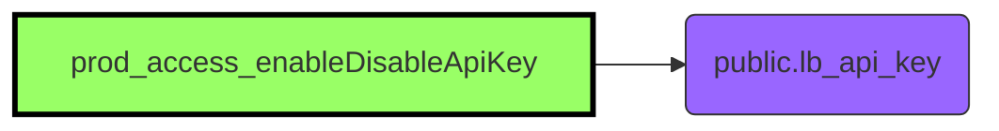

### prod_access_validateApiKeyAndAccess

- Input:

  ```json
  {
    "webService": "ws",
    "api_key": "key",
  }
  ```

- Searches in the database for a key to a service and with matching api key
  hash. If found, updates last access fields in the database for the record.

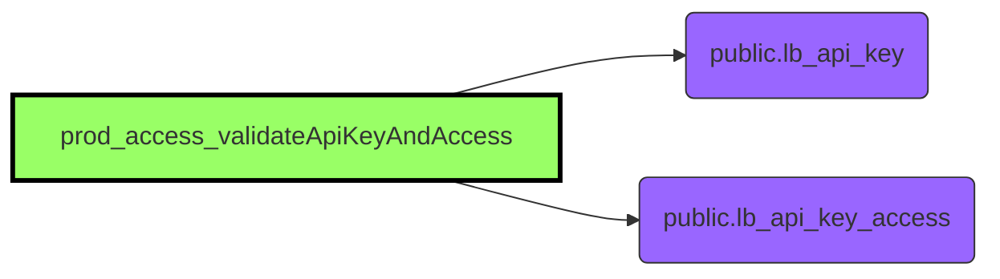

## Production Actions / PandaDocs

### prod_pandaDocs_sendDocument

- Input:

  ```json
  {
    "id": "123",
    "silent": true,
    "data": {}
  }
  ```

- Uses Pandadoc to send a document.
  - Upon error, returned data has property `sendGrief` set.

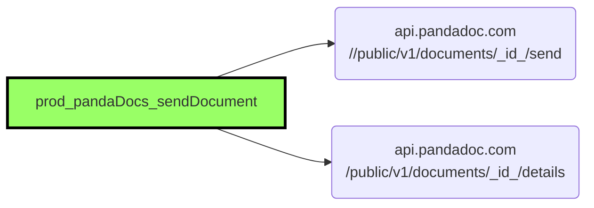

### prod_pandaDocs_createResellerDoc

- Input:

  ```json
  {
    "txtFirstName": "123",
    "txtLastName": "",
    "txtCompanyName": "",
    "txtAddress1": "",
    "txtAddress2": "",
    "txtCity": "",
    "selectProvince": "",
    "txtZip": "",
    "selectCountry": "",
    "selectPhoneCC": "",
    "txtPhoneNum": "",
    "inEmailUser": "",
    "inEmailCompany": "",
    "submission_ref": "",
    "regenerateDoc": true
  }
  ```

- Based on a template (first obtained by name) creates a document.
- If `regenerateDoc` is set, it marks its status as `12˙.

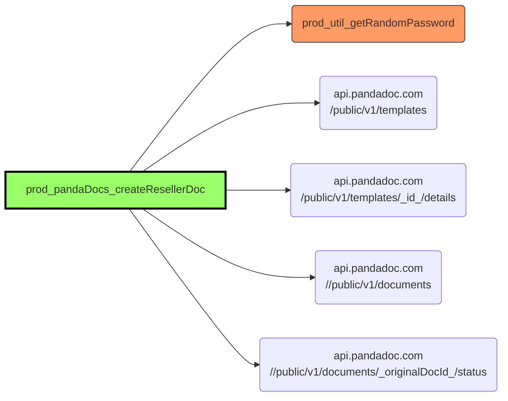

### prod_pandaDocs_getDocDetails

- Input:

  ```json
  {
    "doc_issue_ref": "123"
  }
  ```

- Downloads details of the document from Pandadoc.

```mermaid
graph LR
  classDef this fill:#9f6,stroke:#000,stroke-width:3;
  classDef automation fill:#9f6,stroke:#333;
  classDef action fill:#f96,stroke:#333;
  classDef database fill:#96f,stroke:#333;

  act21[prod_pandaDocs_getDocumentDownload] --> panda(api.pandadoc.com<br>/public/v1/documents/_doc_issue_ref_/details)

  class act21 this
```

### prod_pandaDocs_getDocumentDownload

- Input:

  ```json
  {
    "doc_issue_ref": "123"
  }
  ```

- Downloads a specified document from Pandadoc.

```mermaid
graph LR
  classDef this fill:#9f6,stroke:#000,stroke-width:3;
  classDef automation fill:#9f6,stroke:#333;
  classDef action fill:#f96,stroke:#333;
  classDef database fill:#96f,stroke:#333;

  act22[prod_pandaDocs_getDocumentDownload] --> panda(api.pandadoc.com<br>/public/v1/documents/_doc_issue_ref_/download-protected)

  class act22 this
```

### prod_pandaDocs_getDocs

- No input.

- Obtains all documents from PandaDoc, 25 documents per page at the time.

```mermaid
graph LR
  classDef this fill:#9f6,stroke:#000,stroke-width:3;
  classDef automation fill:#9f6,stroke:#333;
  classDef action fill:#f96,stroke:#333;
  classDef database fill:#96f,stroke:#333;

  act23[prod_pandaDocs_getDocs] --> act24(prod_pandaDocs_getDocPage)

  class act23 this
  class act24 action
```

### prod_pandaDocs_getDocPage

- Input:

  ```json
  {
    "page": 1,
    "count": 25
  }
  ```

- Obtains a specified page of documents from Pandadoc.
  - Pandadoc API most likely returns documents from _(page-1)*count+1_ to
    _page*count_ in some canonical order. Not much we can do about it here.

```mermaid
graph LR
  classDef this fill:#9f6,stroke:#000,stroke-width:3;
  classDef automation fill:#9f6,stroke:#333;
  classDef action fill:#f96,stroke:#333;
  classDef database fill:#96f,stroke:#333;

  act23(prod_pandaDocs_getDocs) --> act24[prod_pandaDocs_getDocPage]
  act24[prod_pandaDocs_getDocPage] --> panda(api.pandadoc.com<br>/public/v1/documents)

  class act24 this
  class act23 action
  class db03 database
```

## Production Actions / Postgres LB Db

### prod_psqlLb_updateDocumentStatus

- Input:

  ```json
  {
    "lb_id": 1,
    "documentData": {
        "status"
    },
    "sendGrief": false
  }
  ```

- Updates a row in `public.lb_registration_subm` with the status of the document.

```mermaid
graph LR
  classDef this fill:#9f6,stroke:#000,stroke-width:3;
  classDef automation fill:#9f6,stroke:#333;
  classDef action fill:#f96,stroke:#333;
  classDef database fill:#96f,stroke:#333;

  act25[prod_psqlLb_updateDocumentStatus] --> db03(public.lb_registration_subm)

  class act25 this
  class db03 database
```

## Production Actions / Slack

### prod_slack_requestUsersLookupByEmail

- Input:

  ```json
  {
    "email": "jane.doe@example.com"
  }
  ```

- Asks slack to obtain user ba email.

```mermaid
graph LR
  classDef this fill:#9f6,stroke:#000,stroke-width:3;
  classDef automation fill:#9f6,stroke:#333;
  classDef action fill:#f96,stroke:#333;
  classDef database fill:#96f,stroke:#333;

  act26[prod_slack_requestUsersLookupByEmail] --> slack(slack.com<br>/api/users.lookupByEmail)

  class act26 this
```

### prod_slack_sendMessage

- Input:

  ```json
  {
    "no_user_do_not_send": true,
    "email": "john.doe@example.com",
    "channel_name": "",
    "message": ""
  }
  ```

- Looks for user in Slack, replaces tags "<tag_user>" in the message with
  user name and posts the message to **notification-document-signing**,
  **notification-reseller-registration**, **vendor-compatibility** or
  **notifications-vendor-hw-matrix** channel. Trying to send over any other
  channel returns `"channel_not_configured"`

```mermaid
graph LR
  classDef this fill:#9f6,stroke:#000,stroke-width:3;
  classDef automation fill:#9f6,stroke:#333;
  classDef action fill:#f96,stroke:#333;
  classDef database fill:#96f,stroke:#333;

  act27[prod_shopify_companyCreate] --> act26(prod_slack_requestUsersLookupByEmail)
  act27[prod_shopify_companyCreate] --> slack(slack)

  class act27 this
```

## Production Actions / Shopify

### prod_shopify_companyCreate

- Input:

  ```json
  {
    "companyName": "acme inc",
    "companyNumber": 42,
    "address1": "",
    "address2": "",
    "city": "",
    "zip": "",
    "email": "",
    "phone": "",
    "zoneCode": "",
    "countryCode": ""
  }
  ```

- Based on `companyName` or `companyNumber`, gets up to 5 companies, up to 25
  contacts per company from Shopify.
  - If none found, one is created and used from here on
- Selects 1st company from the list
- Sets some custom metadata (`company_email`, `vendor`, `reseller`, `vat_number`)
- Retrieves customers based on `email` or `phone`
  - If none found, one is created and used from here on
- Assigns 1st customer as the contact of the 1st company and as the main contact.
- **Q** could there be multiple companies? Multiple persons?
- Finally queries and returns up to 5 companies based on `companyName` or
  `companyNumber`; for each up to 10 locations and up to 25 contacts, for each
  up to 10 addresses; and on some levels up to 15 metadata.

```mermaid
graph LR
  classDef this fill:#9f6,stroke:#000,stroke-width:3;
  classDef automation fill:#9f6,stroke:#333;
  classDef action fill:#f96,stroke:#333;
  classDef database fill:#96f,stroke:#333;

  act28[prod_shopify_companyCreate] --> db04(public.lb_web_service_payload_log)
  act28[prod_shopify_companyCreate] --> shopify1(Shopify Admin API<br>Companies)
  act28[prod_shopify_companyCreate] --> shopify2(Shopify Admin API<br>companyCreate)
  act28[prod_shopify_companyCreate] --> shopify3(Shopify Admin API<br>metafieldsSet)
  act28[prod_shopify_companyCreate] --> shopify4(Shopify Admin API<br>customerCreate)
  act28[prod_shopify_companyCreate] --> shopify5(Shopify Admin API<br>companyAssignCustomerAsContact)
  act28[prod_shopify_companyCreate] --> shopify6(Shopify Admin API<br>companyAssignMainContact)

  class act28 this
  class db04 action
```
