# Automations

This is the state of automations in UI Bakery projects.

Out of scope:

- automations in Debug folder
- (global) variables

Automations below are listed in the order the appear in UI Bakery. Some names
are decorated with one or more of the following symbols.

| Mark | Meaning                           |
|------|-----------------------------------|
| 🡆   | entry action (with execution log) |
| 🕒   | cron triggered                    |
| 🪝   | webhook triggered                 |

While technically any automation can be executed on its own, only the ones
marked with the symbol 🡆 were - there are logs for these executions. Note that
an automation can invoke another automation but the logs go to the original
invoker.

## Sync

- varManualSyncMinutes
- varPotentialSyncMatches
- varSyncedRecords
- varStzsReturnQty

### 🕒🡆 `cronActionDeltaShopifySync_30d_daily`

- At 02:00 AM, only on Sunday
- Input:

  ```json
  {
    "deltaQuery": true,
    "deltaDays": 90,
    "queryOvrrd": "",
    "forceManualSync": false,
    "syncZen": true,
    "syncCryplex": true,
    "triggerSource": "",
    "actionSource": "cr  onActionDeltaShopifySync_30d_daily"
  }
  ```

- It executes `startActionDeltaFullShopifySync`

```mermaid
graph LR
  classDef this fill:#9f6,stroke:#000,stroke-width:3;
  classDef automation fill:#9f6,stroke:#333;
  classDef action fill:#f96,stroke:#333;
  classDef database fill:#96f,stroke:#333;

  cron(🕒) --> aut01[cronActionDeltaShopifySync_30d_daily]
  aut01[cronActionDeltaShopifySync_30d_daily] --> aut03(startActionDeltaFullShopifySync)

  class aut01 this
  class aut03 automation
```



### 🕒🡆 `cronActionDeltaShopifySync_01d_5m`

- Input:

  ```json
  {
   "queryOvrrd": "",
   "deltaDays": 1,
   "deltaQuery": true,
   "forceManualSync": false,
   "triggerSource": "manualOrWebhook",
   "actionSource": "cronActionDeltaShopifySync_01d_5m"
  }
  ```

- executes `startActionDeltaFullShopifySync`

```mermaid
graph LR
  classDef this fill:#9f6,stroke:#000,stroke-width:3;
  classDef automation fill:#9f6,stroke:#333;
  classDef action fill:#f96,stroke:#333;
  classDef database fill:#96f,stroke:#333;

  cron(🕒) --> aut02[cronActionDeltaShopifySync_01d_5m]
  aut02[cronActionDeltaShopifySync_01d_5m] --> aut03(startActionDeltaFullShopifySync)

  class aut02 this
  class aut03 automation
```



### 🡆 `startActionDeltaFullShopifySync`

- Input:

  ```json
  {
   "deltaQuery": true,
   "deltaDays": 1,
   "queryOvrrd": "",
   "forceManualSync": false,
   "syncZen": true,
   "syncCryplex": true,
  }
  ```

  - Gets list of companies to sync (`actionShopifyGetCompaniesList`), and
    executes `bkgrndActionDeltaFullShopifySync` on them.


### 🕒🡆 `cronBkgActionDeltaFullShopifySync`

- Input:
- calls `prod_utils_getGuid` and stores obtained GUID in the table
  `public.log_sync_record`
  Then iterates among all records with the same GUID and calls
  `actionShopifyGetCompaniesListDetails` over the array of those records,
  followed by `bkgrndActionDeltaFullShopifySync`

```mermaid
graph LR
  classDef this fill:#9f6,stroke:#000,stroke-width:3;
  classDef automation fill:#9f6,stroke:#333;
  classDef action fill:#f96,stroke:#333;
  classDef database fill:#96f,stroke:#333;

  cron(🕒) --> aut04[cronBkgActionDeltaFullShopifySync]
  aut04[cronBkgActionDeltaFullShopifySync] --> db07(public.log_sync_record)
  aut04[cronBkgActionDeltaFullShopifySync] --> aut08(actionShopifyGetCompaniesListDetails)
  aut04[cronBkgActionDeltaFullShopifySync] --> aut05(bkgrndActionDeltaFullShopifySync)

  class aut04 this
  class aut08,aut05 automation
  class act05 action
  class db07 database
```



### `bkgrndActionDeltaFullShopifySync`

- obtains company contacts from Shopify (indirectly through `actionShopifyGetCompanyContacts`)
- creates tree arrays of insertion commands (Shopify, Zendesk, Cryplex)


## Sync/Sync Utilities

### `actionSyncGetLatestChecksum`

- Input:
- gets checksum for matching record from `public.log_sync_record`
- returns true if no checksum found or if given checksum is different from the
  obtained one (basically it returns "action required"). Finally removes this
  GUID from `public.log_sync_record`


## Shopify

### `actionShopifyGetCompaniesList`

- Input:

  ```json
  {
   "deltaQuery": true,
   "deltaDays": 10,
   "queryOvrrd": "",
   "forceManualSync": false,
  }
  ```

- Through `actionShopifyGetCompanyIDs` gets list of the company IDs from the
  Shopify that fulfil some criteria, most notably modified after.
- If list is less than or equal to  25 entries, calls
  `actionShopifyGetCompaniesListDetails` on the obtained list of IDs.
- Otherwise calculates checksums of obtained entries and inserts all together
  into the database


### `actionShopifyGetCompaniesListDetails`

- Input: list of company data (elements are either string or object
  containing a filed `record_id`)
- Iterates over the list to up to 1000 elements sequentially, calling
  `actionShopifyGetCompanyData` and probably returning an array of results.


### 🡆 `actionShopifyGetCompanyIDs`

- Input: parameters to steer the repeated (paged) calls.
- Uses GraphQL to call Shopify API at
  `myshopify.com/admin/api/2024-10/graphql.json`
- returns one page of IDs associated with a company


### `actionShopifyGetCompanyContacts`

- Input: apparently list of companies/ids?
- For each, loops over company contacts
  - For each, tries to parse input data and puts it into a list of maps
  (with `.company_id`, `.contact_id` and a bunch of other data). Each element
  also has a checksum.
- Returns an array of these contact objects. Flat.


### `actionShopifyGetCompanyData`

- Input: company id
- Uses GraphQL to query `myshopify.com/admin/api/2024-10/graphql.json` and
 returns company with up to 10 locations, up to 100 contacts, up to 10
 metafields and "vendor" metafield
  - What happens if that is already among 10?
- then recomposes the element so that metafields are top level element.


### `actionTagShopifyVendorUsers`

- Input: customer
- Uses GraphQL to attache an sso tag to this ID at `myshopify.com`.
- Returns an array of email, (some) id and a sso tag (or flag
  `"NO TAG NEEDEED"` if SSO not configured for the vendor). Tag is obtained
  using GraphQL from `myshopify.com/admin/api/2024-10/graphql.json`


## Zendesk

### 🪝🡆 cronShopifyToZenSync

- Input:

  ```json
  {
    "deltaQuery": true,
    "deltaDays": 90,
    "queryOvrrd": "",
    "forceManualSync": false,
  }
  ```

- Performs up to 100 calls to `actionShopifyGetCompanyIDs` to obtain list of
  companies from Shopify
- Similarly performs up to 100 calls of `actionZenGetCompanyIDs` to obtain
  list of companies from ZenDesk
- List of ids from both searches is merged **Q** in `codeGetCompanyList`?
- For every id, a call to `actionSyncShopifyCompany`
- **Q** in `loopSyncShopifyVendorUser`, called action was deleted?

```mermaid
graph LR
  classDef this fill:#9f6,stroke:#000,stroke-width:3;
  classDef automation fill:#9f6,stroke:#333;
  classDef action fill:#f96,stroke:#333;
  classDef database fill:#96f,stroke:#333;

  wh((🪝)) --> aut13[cronShopifyToZenSync]
  aut13[cronShopifyToZenSync] --> aut09(actionShopifyGetCompanyIDs)
  aut13[cronShopifyToZenSync] --> aut16(actionZenGetCompanyIDs)
  aut13[cronShopifyToZenSync] --> aut15(actionSyncShopifyCompany)
  aut13[cronShopifyToZenSync] --> aut12(actionTagShopifyVendorUsers)

  class aut13 this
  class aut09,aut12,aut15,aut16 automation
```



### `actionSyncShopifyVendorUserToZen`

- Gets a user fromZenDesk by id and by email
- Gets organization data from Zendesk
- Gets list of organizations for user
- calculates checksums
- updates or inserts data back to ZenDesk


### `actionSyncShopifyCompany`

- gets a company by an id from Shopify
- looks it up in ZenDesk (1) by id and (2) by name; id precedes name. If not
  found at all, gets id `NEW`.
- **Q** at `codeNormalizedCompanyData` we set `companyDetails['do_not_sync_to_zendesk'] = false;`
  and then test `return !{{steps.codeNormalizedCompanyData.data.do_not_sync_to_zendesk}};`
  which should always be true?
- For new organization (id = NEW) post data to zendesk
- For existing, put new data at the same place.


### 🡆 `actionZenGetCompanyIDs`

- Request 50 organizations from Zendesk


## Cryplex

### 🕒🡆 `cronShopifyToCryplexSync`

- Claims up to 10 records from `public.log_sync_record` that are in status
  `NEW` or `PENDING` or in submission status `GRIEF` and headed to Cryptlex.
- execute `actionSyncShopifyRetailerUserToCryptlex` on these records
- releases the records in the database.


### 🡆 `actionSyncShopifyRetailerUserToCryptlex`

- Input:

  ```json
  {
    "sync": true?,
    "userSyncBlocked": false?,
    "newRecord": ?,
    "sync_metadata": {
      "customer": {
        "id": 37,
        "firstName": "John",
        "lastName": "Doe",
        "email": "john.doe@example.com"
      },
      "company_id": 57,
    },
    "company_id": 42,
    "company_name": "acme inc",
    "primary_company_email": "noreply@acme.com",
    "reseller": ""
  }
  ```

- If company primary email address is present, gets a reseller from Cryptlex
  by company name and by an email
- For some reason it is unhappy if both are present but
  - either ids of the first elements are different or
  - there are multiple hits on email
    - so email must be unique but name not
- **Q** There are some try catch blocks in `codeNormalizeDataReseller` but I
  can't see what would trigger them.


## Cryplex Utils

### `actionSyncUserToCryptlex`

- Input:

  ```json
  {
    "sync": {
      "newRecord": 1,
      "firstName": "Jane",
      "lastName": "Doe",
      "email": "jane.doe@example.com",
      "company": "acme inc",
      "resellerId": 37,
      "role": "important"
    }
  }
  ```

- Generates a new password of length 29. Creates or updates user's record
  (based on `newRecord` value being present), with extra step to make sure
  that an empty last name is patched as such.


## Mailgun Background Email Send

### 🕒🡆 `cronActionProcessEmailSends`

- Claims all (up to 50) records from the table `public.log_email_template_send`
  that are in (submission) status `NEW` or `PENDING` and sends them. Finally,
  releases all records from the table.


## Debug

- 🡆 actionScheduleJob
- 🡆 actionConnGraphQL
- 🡆 actionConnZen
- 🡆 actionConnShopify
- 🡆 actionConnPostgres
- 🡆 actionConnSlack

## Web Services

### 🪝🡆 `wsGetCompatibilityList`

- Input:

  ```json
  {
    "api_key": "#$%&/()",
    "aki_key_lb_id": "",
    "capability": "",
    "granted_by_email": ""
  }
  ```

- Calls an action `actionValidateApiKeyAndAccess` with email and subscription type.

```mermaid
graph LR
  classDef this fill:#9f6,stroke:#000,stroke-width:3;
  classDef automation fill:#9f6,stroke:#333;
  classDef action fill:#f96,stroke:#333;
  classDef database fill:#96f,stroke:#333;

  wh((🪝)) --> aut27[wsGetCompatibilityList]
  aut27[wsGetCompatibilityList] --> aut29(actionValidateApiKeyAndAccess)

  class aut27 this
  class aut29 automation
```

### 🪝🡆 `wsPostEmailSubscription`

- Input:

  ```json
  {
    "email": "john.doe@mail.me",
    "api_key": "#$%&/()",
    "subTypeVal": "MillMage Launch"
  }
  ```

- Validates API key
- If API key ok creates an record in `public.lb_comm_email_subsc`

```mermaid
graph LR
  classDef this fill:#9f6,stroke:#000,stroke-width:3;
  classDef automation fill:#9f6,stroke:#333;
  classDef action fill:#f96,stroke:#333;
  classDef database fill:#96f,stroke:#333;

  wh((🪝)) --> aut28[wsPostEmailSubscription]
  aut28[wsPostEmailSubscription] --> aut29(actionValidateApiKeyAndAccess)
  aut28[wsPostEmailSubscription] --> db01(public.lb_comm_email_subsc)

  class aut28 this
  class aut29 automation
  class db01 database
```

## Web Services / wsActionsToPrivateActionLib

### `actionValidateApiKeyAndAccess`

- Input:

  ```json
  {
    "api_key": "#$%&/()",
    "aki_key_lb_id": "",
    "capability": "",
    "granted_by_email": ""
  }
  ```

- Calls an action `prod_access_validateApiKeyAndAccess` with email and
  a subscription type.

```mermaid
graph LR
  classDef this fill:#9f6,stroke:#000,stroke-width:3;
  classDef automation fill:#9f6,stroke:#333;
  classDef action fill:#f96,stroke:#333;
  classDef database fill:#96f,stroke:#333;

  aut27(wsGetCompatibilityList) --> aut29[actionValidateApiKeyAndAccess]
  aut28(wsPostEmailSubscription) --> aut29[actionValidateApiKeyAndAccess]
  aut29[actionValidateApiKeyAndAccess] --> act18(prod_access_validateApiKeyAndAccess)

  class aut29 this
  class aut27,aut28 automation
  class act18 action
```

## PandaDoc

### 🕒🪝🡆 `actionPandaDocGetHistorical`

- Input:

  ```json
  {
    "rangeMinusDays": 3,
    "docSyncDivByTrig": 1,
    "modified_from": "2025-07-08"
  }
  ```

- on every _n_ minutes it retrieves list of documents modified after (before
  _n_ minutes), the gets the documents through `actionPandaDocGetDocDetails`
  and in another loop calls `actionSyncPandaDocDataToRequest` on every one.
- gets list of documents in draft state or recently published from database
  table `public.lb_registration_subm` and for every one calls
  `prod_pandaDocs_sendDocument` and `prod_psqlLb_updateDocumentStatus`

```mermaid
graph LR
  classDef this fill:#9f6,stroke:#000,stroke-width:3;
  classDef automation fill:#9f6,stroke:#333;
  classDef action fill:#f96,stroke:#333;
  classDef database fill:#96f,stroke:#333;

  cron(🕒) --> aut30[actionPandaDocGetHistorical]
  wh((🪝)) --> aut30[actionPandaDocGetHistorical]
  aut30[actionPandaDocGetHistorical] --> aut31(actionPandaDocGetDocsByPage)
  aut30[actionPandaDocGetHistorical] --> aut32(actionPandaDocGetDocDetails)
  aut30[actionPandaDocGetHistorical] --> aut33(actionSyncPandaDocDataToRequest)
  aut30[actionPandaDocGetHistorical] --> db03(public.lb_registration_subm)
  aut30[actionPandaDocGetHistorical] --> act19(prod_pandaDocs_sendDocument)
  aut30[actionPandaDocGetHistorical] --> act25(prod_psqlLb_updateDocumentStatus)

  class aut30 this
  class aut31,aut32,aut33 automation
  class act19,act25 action
  class db03 database
```

### `actionPandaDocGetDocsByPage`

- Input:

  ```json
  {
    "page_number": 1,
    "rec_count": 2,
    "modified_from": "2025-07-07"
  }
  ```

- Gets a list of actionable documents from PandaDoc.
  - Actionable: in draft or recently published.

```mermaid
graph LR
  classDef this fill:#9f6,stroke:#000,stroke-width:3;
  classDef automation fill:#9f6,stroke:#333;
  classDef action fill:#f96,stroke:#333;
  classDef database fill:#96f,stroke:#333;

  aut30(actionPandaDocGetHistorical) --> aut31[actionPandaDocGetDocsByPage]
  aut31[actionPandaDocGetDocsByPage] --> panda1(pandadoc.com<br>/public/v1/documents)

  class aut31 this
  class aut30 automation
```

### `actionPandaDocGetDocDetails`

- Input:

  ```json
  {
    "id": 123
  }
  ```

- Gets a details on the document specified by document id.

```mermaid
graph LR
  classDef this fill:#9f6,stroke:#000,stroke-width:3;
  classDef automation fill:#9f6,stroke:#333;
  classDef action fill:#f96,stroke:#333;
  classDef database fill:#96f,stroke:#333;

  aut30(actionPandaDocGetHistorical) --> aut32[actionPandaDocGetDocDetails]
  aut32[actionPandaDocGetDocDetails] --> panda2(pandadoc.com<br>public/v1/documents/_id_/detail)

  class aut32 this
  class aut30 automation
```

### `actionSyncPandaDocDataToRequest`

- Input:

  ```json
  {
    "company_name": "Laser maker",
    "id": 42
  }
  ```

- Gets a registration information on specified company.

```mermaid
graph LR
  classDef this fill:#9f6,stroke:#000,stroke-width:3;
  classDef automation fill:#9f6,stroke:#333;
  classDef action fill:#f96,stroke:#333;
  classDef database fill:#96f,stroke:#333;

  aut30(actionPandaDocGetHistorical) --> aut33[actionSyncPandaDocDataToRequest]
  aut33[actionSyncPandaDocDataToRequest] --> db03(public.lb_registration_subm)

  class aut33 this
  class aut30 automation
  class db03 database
```

### 🪝🡆 `wsHookRecipientCompleted`

- Input assumes a JSON array of length exactly 1. This may not hold in the
  case of bulk changes (if there are any) and the remaining documents will be
  silently ignored (perhaps processed at a later time).
  [Payload example](https://developers.pandadoc.com/docs/webhooks#webhook-payload-examples).
- In dev, `name` must start with `DEV`. In `prod`, it mustn't.
- Loads data from `public.lb_registration_subm` with given id (`doc_issue_red`).
- Notifies the next signer over mailgun

```mermaid
graph LR
  classDef this fill:#9f6,stroke:#000,stroke-width:3;
  classDef automation fill:#9f6,stroke:#333;
  classDef action fill:#f96,stroke:#333;
  classDef database fill:#96f,stroke:#333;

  wh((🪝)) --> aut34[wsHookRecipientCompleted]
  aut34[wsHookRecipientCompleted] --> db04(public.lb_web_service_payload_log)
  aut34[wsHookRecipientCompleted] --> db03(public.lb_registration_subm)
  aut34[wsHookRecipientCompleted] --> act04(prod_mailgun_getEmailTemplates)
  aut34[wsHookRecipientCompleted] --> act27(prod_slack_sendMessage)
  aut34[wsHookRecipientCompleted] --> db05(public.log_email_template_send)
  aut34[wsHookRecipientCompleted] --> db06(public.log_registration_sub)

  class aut34 this
  class act04,act27 action
  class db03,db04,db05,db06 database
```

### 🪝🡆 `wsHookDocumentReady`

- Input assumes a JSON array of length exactly 1. This may not hold in the
  case of bulk changes (if there are any) and the remaining documents will be
  silently ignored (perhaps processed at a later time).
- In dev, document name `name` must start with `DEV`. In `prod`, it mustn't.
- If document in question has metadata already, they are updated. Otherwise
  the record is created in Shopify and updated accordingly in our database.

```mermaid
graph LR
  classDef this fill:#9f6,stroke:#000,stroke-width:3;
  classDef automation fill:#9f6,stroke:#333;
  classDef action fill:#f96,stroke:#333;
  classDef database fill:#96f,stroke:#333;

  wh((🪝)) --> aut35[wsHookDocumentReady]
  aut35[wsHookDocumentReady] --> db04(public.lb_web_service_payload_log)
  aut35[wsHookDocumentReady] --> db03(public.lb_registration_subm)
  aut35[wsHookDocumentReady] --> db02(public.lb_registration_chklst)
  aut35[wsHookDocumentReady] --> act28(prod_shopify_companyCreate)
  aut35[wsHookDocumentReady] --> act27(prod_slack_sendMessage)

  class aut35 this
  class act27,act28 action
  class db02,db03,db04 database
```

### 🪝🡆 `wsHookDocumentStateChange`

- Input assumes a JSON array of length exactly 1. This may not hold in the
  case of bulk changes (if there are any) and the remaining documents will be
  silently ignored (perhaps processed at a later time).
- In dev, document name `name` must start with `DEV`. In `prod`, it mustn't.
- Updates document status in the database. If new status is `'DOCUMENT SENT'`,

```mermaid
graph LR
  classDef this fill:#9f6,stroke:#000,stroke-width:3;
  classDef automation fill:#9f6,stroke:#333;
  classDef action fill:#f96,stroke:#333;
  classDef database fill:#96f,stroke:#333;

  wh((🪝)) --> aut36[wsHookDocumentStateChange]
  aut36[wsHookDocumentStateChange] --> db04(public.lb_web_service_payload_log)
  aut36[wsHookDocumentStateChange] --> db03(public.lb_registration_subm)
  aut36[wsHookDocumentStateChange] --> act04(prod_mailgun_getEmailTemplates)
  aut36[wsHookDocumentStateChange] --> act27(prod_slack_sendMessage)
  aut36[wsHookDocumentStateChange] --> db05(public.log_email_template_send)

  class aut36 this
  class act04,act27 action
  class db03,db04,db05,db8,db9 database
```

## LB Vendor Reseller Processes

## Utils

### `utils_getStringChecksum`

- Input: any
- Calculates a checksum of a string

```mermaid
graph LR
  classDef this fill:#9f6,stroke:#000,stroke-width:3;
  classDef automation fill:#9f6,stroke:#333;
  classDef action fill:#f96,stroke:#333;
  classDef database fill:#96f,stroke:#333;

  aut37[utils_getStringChecksum] --> act11(prod_utils_getStringChecksum)

  class aut37 automation
  class act11 action
```
