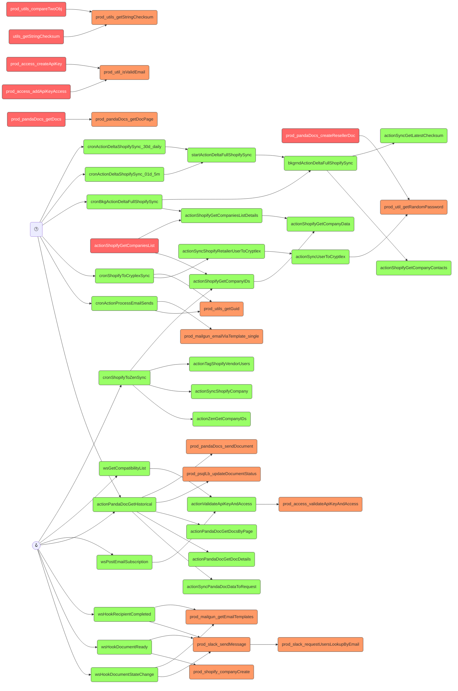

# Call graph

Call graph without external sinks (web services, database tables, ...).

```mermaid
graph LR
  classDef automation fill:#9f6,stroke:#333;
  classDef action fill:#f96,stroke:#333;
  classDef database fill:#96f,stroke:#333;
  classDef error fill:#f66,stroke:#,color:#fff;

  act10(prod_utils_compareTwoObj) --> act11(prod_utils_getStringChecksum)
  act13(prod_access_createApiKey) --> act08(prod_util_isValidEmail)
  act14(prod_access_addApiKeyAccess) --> act08(prod_util_isValidEmail)
  act20(prod_pandaDocs_createResellerDoc) --> act07(prod_util_getRandomPassword)
  act23(prod_pandaDocs_getDocs) --> act24(prod_pandaDocs_getDocPage)
  act27(prod_slack_sendMessage) --> act26(prod_slack_requestUsersLookupByEmail)
  aut01(cronActionDeltaShopifySync_30d_daily) --> aut03(startActionDeltaFullShopifySync)
  aut02(cronActionDeltaShopifySync_01d_5m) --> aut03(startActionDeltaFullShopifySync)
  aut03(startActionDeltaFullShopifySync) --> aut05(bkgrndActionDeltaFullShopifySync)
  aut04(cronBkgActionDeltaFullShopifySync) --> aut05(bkgrndActionDeltaFullShopifySync)
  aut04(cronBkgActionDeltaFullShopifySync) --> aut08(actionShopifyGetCompaniesListDetails)
  aut05(bkgrndActionDeltaFullShopifySync) --> aut06(actionSyncGetLatestChecksum)
  aut05(bkgrndActionDeltaFullShopifySync) --> aut10(actionShopifyGetCompanyContacts)
  aut07(actionShopifyGetCompaniesList) --> aut08(actionShopifyGetCompaniesListDetails)
  aut07(actionShopifyGetCompaniesList) --> aut09(actionShopifyGetCompanyIDs)
  aut08(actionShopifyGetCompaniesListDetails) --> aut11(actionShopifyGetCompanyData)
  aut09(actionShopifyGetCompanyIDs) --> aut11(actionShopifyGetCompanyData)
  aut13(cronShopifyToZenSync) --> aut09(actionShopifyGetCompanyIDs)
  aut13(cronShopifyToZenSync) --> aut12(actionTagShopifyVendorUsers)
  aut13(cronShopifyToZenSync) --> aut15(actionSyncShopifyCompany)
  aut13(cronShopifyToZenSync) --> aut16(actionZenGetCompanyIDs)
  aut17(cronShopifyToCryplexSync) --> act05(prod_utils_getGuid)
  aut17(cronShopifyToCryplexSync) --> aut18(actionSyncShopifyRetailerUserToCryptlex)
  aut18(actionSyncShopifyRetailerUserToCryptlex) --> aut19(actionSyncUserToCryptlex)
  aut19(actionSyncUserToCryptlex) --> act07(prod_util_getRandomPassword)
  aut20(cronActionProcessEmailSends) --> act02(prod_mailgun_emailViaTemplate_single)
  aut20(cronActionProcessEmailSends) --> act05(prod_utils_getGuid)
  aut27(wsGetCompatibilityList) --> aut29(actionValidateApiKeyAndAccess)
  aut28(wsPostEmailSubscription) --> aut29(actionValidateApiKeyAndAccess)
  aut29(actionValidateApiKeyAndAccess) --> act18(prod_access_validateApiKeyAndAccess)
  aut30(actionPandaDocGetHistorical) --> act19(prod_pandaDocs_sendDocument)
  aut30(actionPandaDocGetHistorical) --> act25(prod_psqlLb_updateDocumentStatus)
  aut30(actionPandaDocGetHistorical) --> aut31(actionPandaDocGetDocsByPage)
  aut30(actionPandaDocGetHistorical) --> aut32(actionPandaDocGetDocDetails)
  aut30(actionPandaDocGetHistorical) --> aut33(actionSyncPandaDocDataToRequest)
  aut34(wsHookRecipientCompleted) --> act04(prod_mailgun_getEmailTemplates)
  aut34(wsHookRecipientCompleted) --> act27(prod_slack_sendMessage)
  aut35(wsHookDocumentReady) --> act27(prod_slack_sendMessage)
  aut35(wsHookDocumentReady) --> act28(prod_shopify_companyCreate)
  aut36(wsHookDocumentStateChange) --> act04(prod_mailgun_getEmailTemplates)
  aut36(wsHookDocumentStateChange) --> act27(prod_slack_sendMessage)
  aut37(utils_getStringChecksum) --> act11(prod_utils_getStringChecksum)
  cron(🕒) --> aut01(cronActionDeltaShopifySync_30d_daily)
  cron(🕒) --> aut02(cronActionDeltaShopifySync_01d_5m)
  cron(🕒) --> aut04(cronBkgActionDeltaFullShopifySync)
  cron(🕒) --> aut17(cronShopifyToCryplexSync)
  cron(🕒) --> aut20(cronActionProcessEmailSends)
  cron(🕒) --> aut30(actionPandaDocGetHistorical)
  wh((🪝)) --> aut13(cronShopifyToZenSync)
  wh((🪝)) --> aut27(wsGetCompatibilityList)
  wh((🪝)) --> aut28(wsPostEmailSubscription)
  wh((🪝)) --> aut30(actionPandaDocGetHistorical)
  wh((🪝)) --> aut34(wsHookRecipientCompleted)
  wh((🪝)) --> aut35(wsHookDocumentReady)
  wh((🪝)) --> aut36(wsHookDocumentStateChange)

  class act10,act13,act14,act20,act23 error
  class aut07,aut37 error
  class aut01,aut02,aut03,aut04,aut05,aut06,aut07,aut08,aut09,aut10,aut11,aut12,aut13,aut14,aut15,aut16,aut17,aut18,aut19,aut20,aut21,aut22,aut23,aut24,aut25,aut26,aut27,aut28,aut29,aut30,aut31,aut32,aut33,aut34,aut35,aut36,aut37,aut38,aut39 automation
  class act01,act02,act03,act04,act05,act06,act07,act08,act09,act10,act11,act12,act13,act14,act15,act16,act17,act18,act19,act20,act21,act22,act23,act24,act25,act26,act27,act28,act29,act30,act31,act32,act33,act34,act35,act36,act37,act38,act39 action
  class act10,act13,act14,act20,act23 error
  class aut07,aut37 error
```
