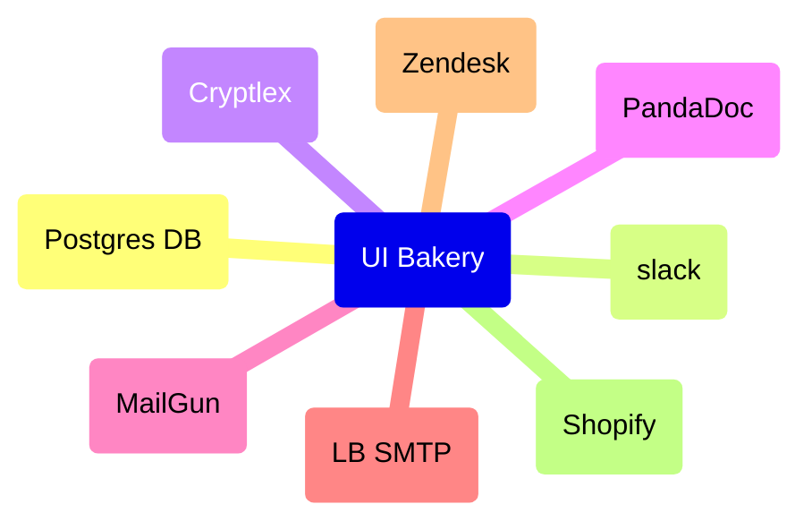

# Data sources

Below are listed the data sources used in UI Bakery projects (Lightburn Portal,
Lightburn Vendor Compatibility).

Information provided should be sufficient to recreate UI Bakery from scratch.
Some secrets are stored elsewhere and are marked by **TBD**. Eventually they
will appear in Keeper or another secret management solution.

## Automations

| Name                                                         | Automations | Actions Lib | Portal | Vendor Compatibility |
|--------------------------------------------------------------|:-----------:|:-----------:|:------:|:--------------------:|
| Zendesk                                                      |      ✅      |             |        |          ✅           |
| Shopify Admin API                                            |      ✅      |      ✅      |        |                      |
| Lightburn Slack Integration - vendor-compatibility           |      ✅      |      ✅      |        |                      |
| Lightburn Slack Integration - notifications-vendor-hw-matrix |      ✅      |      ✅      |        |                      |
| Lightburn (PG)                                               |      ✅      |      ✅      |   ✅    |          ✅           |
| PandaDocs                                                    |      ✅      |      ✅      |   ✅    |          ✅           |
| Cryptlex                                                     |      ✅      |      ✅      |        |                      |

### Zendesk

- HTTP
- [https://lightburnsoftware.zendesk.com](https://lightburnsoftware.zendesk.com)
- Authorization
  - OAuth2

### Shopify Admin API

- GraphQL
- [https://lightburn-software-llc.myshopify.com/admin/api/2024-10/graphql.json](https://lightburn-software-llc.myshopify.com/admin/api/2024-10/graphql.json)
- Authorization
  - header `Authorization: <key>`
  - password [GCP secret](https://console.cloud.google.com/security/secret-manager?inv=1&invt=Ab2G_w&project=lb-infra)

### Lightburn Slack Integration - vendor-compatibility

This datasource can accept messages and publishes them into a selected channel.
Channel and user are encoded in the endpoint.

- Channel: #vendor-compatibility
- User: LB Admin Portal

- Slack integration
- Hook URL: as configured in Slack; available in Keeper
- Authorization
  - Allow anonymous access

### Lightburn Slack Integration - notifications-vendor-hw-matrix

This datasource can accept messages and publishes them into a selected channel.
Channel and user are encoded in the endpoint.

- Channel: #notifications-vendor-hw-matrix
- User: LB Admin Portal

- Slack integration
- Hook URL: as configured in Slack; available in Keeper
- Authorization
  - Allow anonymous access

### Lightburn (PG)

- Database
  - host 35.196.117.104
  - user `lb_ap_uibakery`
  - password [GCP secret](https://console.cloud.google.com/security/secret-manager?inv=1&invt=Ab2G_w&project=lb-infra)

### PandaDocs

- HTTP
- [https://api.pandadoc.com](https://api.pandadoc.com)
- Authorization
  - header `Authorization: API-Key <key>`
  - key: **TBD**
  - Allow anonymous access

### Cryptlex

- HTTP
- [https://api.cryptlex.com](https://api.cryptlex.com)
- Authorization
  - header `Authorization: Bearer <key>`
  - key: **TBD**

## All apps

| Name                                                             | Automations | Actions Lib | Portal | Vendor Compatibility |
|------------------------------------------------------------------|:-----------:|:-----------:|:------:|:--------------------:|
| SMTP                                                             |             |             |        |          ✅           |
| Mailgun API                                                      |             |      ✅      |        |                      |
| PandaDocs (Prod)                                                 |             |      ✅      |        |                      |
| Lightburn Slack Integration - notification-reseller-registration |             |      ✅      |        |          ✅           |
| Lightburn Slack Integration                                      |             |      ✅      |        |                      |
| Lightburn Slack Integration - notification-document-signing      |             |      ✅      |        |                      |

### SMTP

- SMTP
  - See keeper.com shared folder `UI Bakery` for host, port, username and
    password.
  - Allow anonymous access

### Mailgun API

- HTTP
- [https://api.mailgun.net/v3/mg.lightburnsoftware.com](https://api.mailgun.net/v3/mg.lightburnsoftware.com)
- Authorization
  - Basic auth
  - See keeper.com shared folder `UI Bakery` for host, port, username and
    password.

### PandaDocs (Prod)

- HTTP
- [https://api.pandadoc.com](https://api.pandadoc.com)
- Authorization
  - header `Authorization: API-Key <key>`
  - key: **TBD**

### Lightburn Slack Integration - notification-reseller-registration

This datasource can accept messages and publishes them into a selected channel.
Channel and user are encoded in the endpoint.

- Channel: #notification-reseller-registration
- User: LB Admin Portal

- Slack integration
- Hook URL: as configured in Slack; available in Keeper
- Authorization
  - Allow anonymous access

### Lightburn Slack Integration

- Slack integration
- Hook URL: [https://slack.com](https://slack.com)
- Authorization
  - header `Authorization: Bearer <key>`
  - key: **TBD**
  - Allow anonymous access

### Lightburn Slack Integration - notification-document-signing

This datasource can accept messages and publishes them into a selected channel.
Channel and user are encoded in the endpoint.

- Channel: #notification-document-signing
- User: LB Admin Portal

- Slack integration
- Hook URL: as configured in Slack; available in Keeper
- Authorization
  - Allow anonymous access
